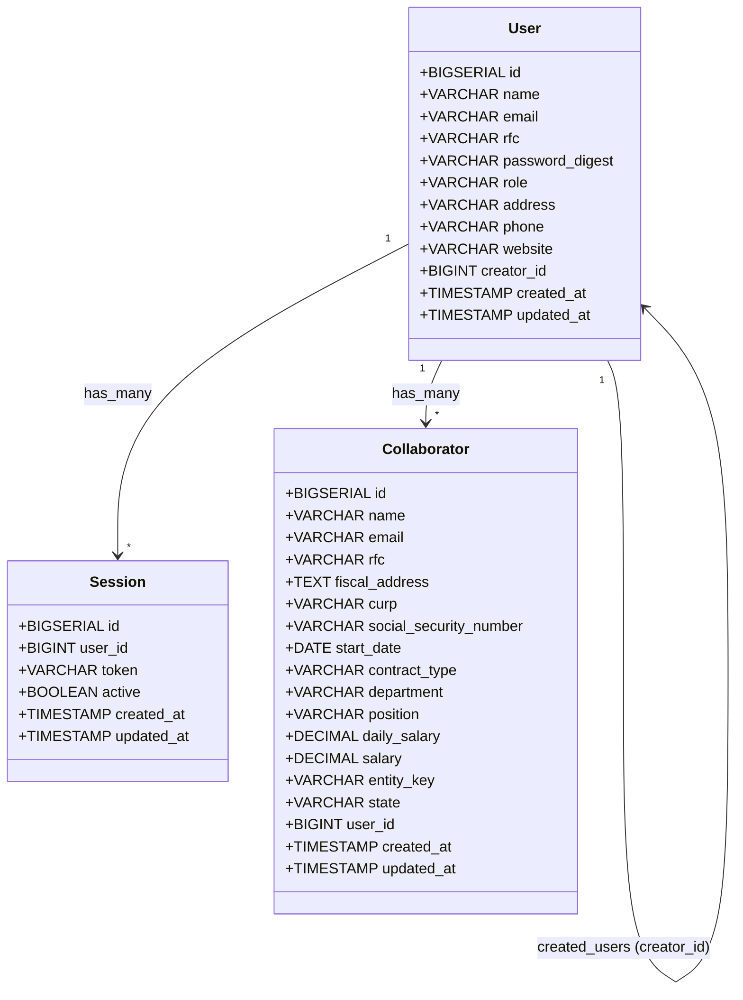

# Diagrama UML - Backend API

## Diagrama de Clases (Mermaid)



## Tabla: users

| Campo           | Tipo         | Descripción              | Restricciones             |
| --------------- | ------------ | ------------------------ | ------------------------- |
| id              | BIGSERIAL    | ID único del usuario     | PK                        |
| name            | VARCHAR(100) | Nombre completo          | NOT NULL                  |
| email           | VARCHAR(100) | Correo electrónico       | UNIQUE, NOT NULL          |
| rfc             | VARCHAR(13)  | RFC (encriptado)         | UNIQUE, NOT NULL          |
| password_digest | VARCHAR(255) | Hash de contraseña       | NOT NULL                  |
| role            | VARCHAR(20)  | Rol (admin/user)         | DEFAULT 'user'            |
| address         | VARCHAR(255) | Dirección                | Opcional para admin       |
| phone           | VARCHAR(50)  | Teléfono                 | Opcional para admin       |
| website         | VARCHAR(255) | Sitio web                | Opcional para admin       |
| creator_id      | BIGINT       | ID del usuario creador   | FK → users(id), NULLABLE  |
| created_at      | TIMESTAMP    | Fecha de creación        | DEFAULT CURRENT_TIMESTAMP |
| updated_at      | TIMESTAMP    | Fecha de actualización   | AUTO                      |

## Tabla: sessions

| Campo      | Tipo         | Descripción            | Restricciones             |
| ---------- | ------------ | ---------------------- | ------------------------- |
| id         | BIGSERIAL    | ID único de sesión     | PK                        |
| user_id    | BIGINT       | ID del usuario         | FK → users(id), NOT NULL  |
| token      | VARCHAR(255) | Token de sesión        | UNIQUE, NOT NULL          |
| active     | BOOLEAN      | Sesión activa          | DEFAULT TRUE              |
| created_at | TIMESTAMP    | Fecha de creación      | DEFAULT CURRENT_TIMESTAMP |
| updated_at | TIMESTAMP    | Fecha de actualización | AUTO                      |

## Tabla: collaborators

| Campo                  | Tipo          | Descripción            | Restricciones             |
| ---------------------- | ------------- | ---------------------- | ------------------------- |
| id                     | BIGSERIAL     | ID único               | PK                        |
| name                   | VARCHAR(100)  | Nombre                 | NOT NULL                  |
| email                  | VARCHAR(100)  | Correo                 | NOT NULL                  |
| rfc                    | VARCHAR(13)   | RFC (encriptado)       | NOT NULL                  |
| fiscal_address         | TEXT          | Domicilio fiscal       | NOT NULL                  |
| curp                   | VARCHAR(18)   | CURP (encriptado)      | NOT NULL                  |
| social_security_number | VARCHAR(20)   | NSS (encriptado)       | NOT NULL                  |
| start_date             | DATE          | Fecha inicio laboral   | NOT NULL                  |
| contract_type          | VARCHAR(50)   | Tipo de contrato       | NOT NULL                  |
| department             | VARCHAR(100)  | Departamento           | NOT NULL                  |
| position               | VARCHAR(100)  | Puesto                 | NOT NULL                  |
| daily_salary           | DECIMAL(10,2) | Salario diario         | NOT NULL                  |
| salary                 | DECIMAL(10,2) | Salario                | NOT NULL                  |
| entity_key             | VARCHAR(20)   | Clave entidad          | NOT NULL                  |
| state                  | VARCHAR(50)   | Estado                 | NOT NULL                  |
| user_id                | BIGINT        | ID del propietario     | FK → users(id), NOT NULL  |
| created_at             | TIMESTAMP     | Fecha de creación      | DEFAULT CURRENT_TIMESTAMP |
| updated_at             | TIMESTAMP     | Fecha de actualización | AUTO                      |

## Relaciones

```
┌──────────────────────┐
│        users         │
│                      │
│  id (PK)             │◄─────────────────────┐
│  name                │                      │
│  email (UNIQUE)      │                      │
│  rfc (UNIQUE)        │      Self-Reference  │
│  password_digest     │      (created_users)  │
│  role                │                      │
│  address             │                      │
│  phone               │                      │
│  website             │                      │
│  creator_id (FK) ────│──────────────────────┘
│  created_at          │
│  updated_at          │
└──────────┬───────────┘
           │
     ┌─────┴──────┐
     │ 1        1 │
     │            │
     ▼ *          ▼ *
┌──────────┐  ┌──────────────┐
│ sessions │  │ collaborators│
│          │  │              │
│ id (PK)  │  │ id (PK)      │
│ user_id  │  │ user_id (FK) │
│ token    │  │ name         │
│ active   │  │ email        │
│          │  │ rfc          │
│          │  │ fiscal_addr  │
│          │  │ curp         │
│          │  │ nss          │
│          │  │ start_date   │
│          │  │ contract_type│
│          │  │ department   │
│          │  │ position     │
│          │  │ daily_salary │
│          │  │ salary       │
│          │  │ entity_key   │
│          │  │ state        │
└──────────┘  └──────────────┘

Cardinalidad:
  users (1) ──→ (*) sessions      : ON DELETE CASCADE
  users (1) ──→ (*) collaborators : ON DELETE CASCADE
  users (1) ──→ (*) users         : ON DELETE SET NULL (creator_id)
```
